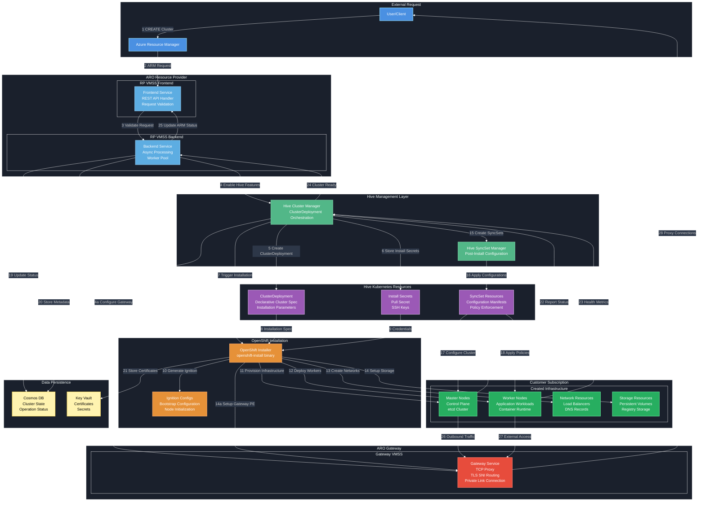

# ARO Resource Provider

This document describes how the instances of the Azure Red Hat OpenShift (ARO) Resource Provider and Gateway are deployed in Azure.

## Overview

The ARO Resource Provider (RP) and Gateway are deployed as **Azure Virtual Machine Scale Sets (VMSS)** using ARM templates. This architecture provides high availability, scalability, and version management capabilities.

## Architecture Diagram

### OpenShift Cluster Creation via Hive

### OpenShift Cluster Creation Flow via Hive

The diagram shows the complete flow for creating OpenShift clusters through Hive integration:

**1-4. Request Processing:**
- User submits cluster creation request to Azure Resource Manager
- ARM forwards the request to RP Frontend Service
- Frontend validates request and passes to Backend for async processing
- Backend determines cluster should be created via Hive (feature flag enabled)

**5-7. Hive Orchestration Setup:**
- Hive Cluster Manager creates a ClusterDeployment Kubernetes resource
- Install secrets (pull secret, SSH keys) are securely stored
- OpenShift Installer is triggered with ClusterDeployment specification

**8-14. OpenShift Installation Process:**
- ClusterDeployment provides installation parameters to OpenShift Installer
- Installer retrieves credentials and pull secrets
- Ignition configs are generated for node bootstrapping
- Azure infrastructure is provisioned: Master nodes, Worker nodes, Networks, Storage

**15-18. Post-Installation Configuration:**
- Hive Cluster Manager creates SyncSet resources for post-install configuration
- SyncSet Manager applies configuration manifests and policies
- Cluster components are configured according to organizational standards
- Security policies and operational tools are deployed

**19-21. State Management:**
- Backend service updates cluster status in Cosmos DB
- Hive Cluster Manager stores cluster metadata and installation state
- Installer stores certificates and cluster access credentials in Key Vault

**22-25. Monitoring & Completion:**
- Master and Worker nodes report health status back to Hive
- Hive Cluster Manager monitors cluster readiness
- Once cluster is fully operational, status is reported to Backend
- Backend updates ARM with final cluster creation status

**26-28. Gateway Integration:**
- Master nodes route outbound traffic through the Gateway service
- Worker nodes access external resources via Gateway proxy
- Gateway provides secure, controlled connectivity for cluster egress traffic

This Hive-based approach provides declarative cluster management, GitOps integration, and enhanced operational capabilities compared to direct OpenShift installer usage.
