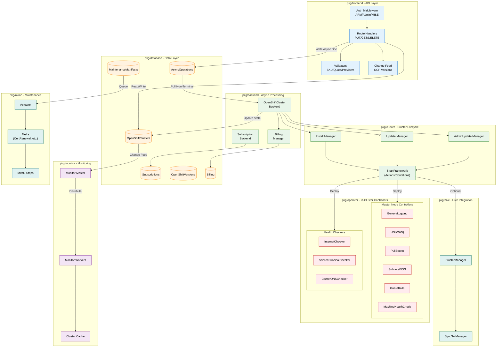
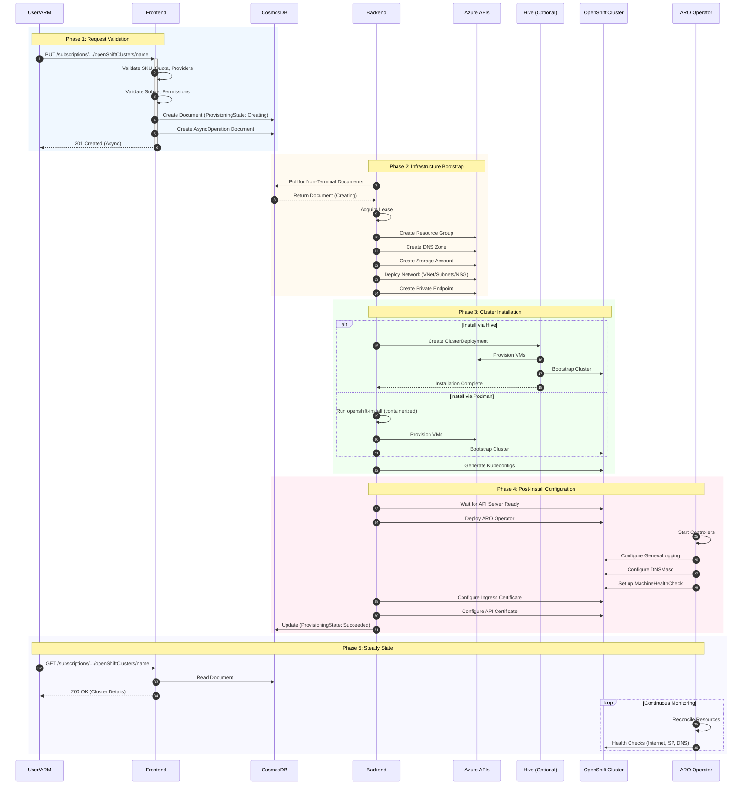

# ARO-RP Architecture Diagrams

This document provides visual representations of the Azure Red Hat OpenShift Resource Provider (ARO-RP) architecture at different levels of detail.

## Quick Reference

| Component | Purpose | Location |
|-----------|---------|----------|
| Frontend | ARM API handler | `pkg/frontend` |
| Backend | Async cluster operations | `pkg/backend` |
| Monitor | Cluster health monitoring | `pkg/monitor` |
| Gateway | Secure cluster access proxy | `pkg/gateway` |
| Portal | SRE admin interface | `pkg/portal` |
| Operator | In-cluster reconciliation | `pkg/operator` |
| MIMO | Automated maintenance | `pkg/mimo` |

---

## 1. High-Level Architecture

This diagram shows the main services, external dependencies, and data flow from a 10,000-foot view.

```mermaid
flowchart TB
    subgraph External["☁️ External Clients"]
        ARM["Azure Resource Manager"]
        CLI["az aro CLI"]
        SRE["SRE/Admin"]
    end

    subgraph AroRP["🔧 ARO-RP Services"]
        direction TB
        FE["Frontend<br/>(API Server)"]
        BE["Backend<br/>(Async Workers)"]
        MON["Monitor<br/>(Health Watcher)"]
        GW["Gateway<br/>(Cluster Proxy)"]
        PORTAL["Portal<br/>(Admin UI)"]
        MIMO["MIMO Actuator<br/>(Maintenance)"]
    end

    subgraph Azure["☁️ Azure Services"]
        COSMOS[("CosmosDB")]
        KV["Key Vault"]
        STORAGE["Storage<br/>Accounts"]
        VNET["Virtual<br/>Network"]
    end

    subgraph Cluster["🔴 OpenShift Cluster"]
        OPERATOR["ARO Operator"]
        API["API Server"]
        NODES["Worker Nodes"]
    end

    subgraph HiveCluster["🐝 Hive Cluster<br/>(Optional)"]
        HIVE["Hive Controller"]
    end

    %% External connections
    ARM -->|"PUT/DELETE<br/>Clusters"| FE
    CLI -->|"REST API"| ARM
    SRE -->|"Admin Actions"| PORTAL

    %% Internal RP flow
    FE <-->|"Read/Write<br/>Documents"| COSMOS
    FE -->|"Queue<br/>Operations"| BE
    BE <-->|"Process<br/>Async Ops"| COSMOS
    BE -->|"Create/Update<br/>Resources"| Azure
    BE <-.->|"Install via Hive<br/>(Optional)"| HIVE
    MON -->|"Watch<br/>Clusters"| COSMOS
    MON -->|"Health<br/>Checks"| Cluster
    GW -->|"Proxy<br/>Requests"| API
    PORTAL -->|"Admin<br/>Commands"| FE
    MIMO -->|"Maintenance<br/>Tasks"| Cluster

    %% Cluster connections
    BE -->|"Deploy<br/>Operator"| OPERATOR
    OPERATOR -->|"Reconcile<br/>Resources"| NODES
    BE -->|"Provision<br/>Infrastructure"| Azure

    %% Styling
    classDef azure fill:#E3F2FD,stroke:#1976D2,color:#000
    classDef aro fill:#FFF3E0,stroke:#F57C00,color:#000
    classDef external fill:#F5F5F5,stroke:#616161,color:#000
    classDef cluster fill:#FFEBEE,stroke:#C62828,color:#000

    class ARM,CLI,SRE external
    class FE,BE,MON,GW,PORTAL,MIMO aro
    class COSMOS,KV,STORAGE,VNET azure
    class OPERATOR,API,NODES,HIVE cluster
```



**Key Takeaways:**
- **Frontend** receives all ARM requests and performs synchronous validation
- **Backend** handles long-running operations asynchronously using a work-queue pattern
- **CosmosDB** is the single source of truth for cluster state
- **Monitor** continuously watches cluster health independent of user requests
- **Hive** integration is optional and used for cluster installation in newer deployments

---

## 2. Detailed Component Architecture

This diagram shows internal components and their interactions within the RP.



**Key Takeaways:**
- **Step Framework** (`pkg/util/steps`) is reused across Install, Update, and AdminUpdate flows
- **Change Feeds** from CosmosDB drive both the Monitor and Frontend version caching
- **Operator Controllers** are divided between Master-only and Worker roles
- **MIMO** uses the same step pattern but operates on maintenance manifests

---

## 3. Cluster Lifecycle & Data Flow

This diagram shows the journey of a cluster from creation to running state.



**Key Takeaways:**
- **Async Pattern**: Frontend returns immediately; backend processes asynchronously
- **Lease-Based Processing**: Backend uses document leases for distributed work coordination
- **Two Install Paths**: Hive (newer) or Podman (legacy) for cluster bootstrapping
- **Operator Deployment**: Happens after cluster API is available, not during bootstrap

---

## Design Decisions & Technical Debt

### Architectural Choices Explained

#### 1. **CosmosDB as Single Source of Truth**
```
Why: ARM Resource Provider contract requires document-based storage with change feeds.
Trade-off: No native document patching requires careful optimistic concurrency handling.
See: MissingFielder pattern in pkg/api for upgrade compatibility.
```

#### 2. **Frontend/Backend Split**
```
Why: ARM requires synchronous validation + async long-running operations.
Trade-off: Complexity in state management between the two.
Benefit: Horizontal scaling of both components independently.
```

#### 3. **Hive vs Podman Installation**
```
Why: Hive enables GitOps-style cluster management and better observability.
Historical: Podman was original approach; Hive adopted later.
Current: Both paths maintained for regional rollout and fallback.
Technical Debt: Dual code paths increase maintenance burden.
```

#### 4. **ARO Operator In-Cluster**
```
Why: Some configurations require cluster-internal access (MachineConfigs, etc.).
Trade-off: Must deploy/update operator as part of cluster lifecycle.
Workaround: operator cut-off version (4.7.0) to skip updates for old clusters.
```

#### 5. **DNSMasq Workaround**
```
Why: Custom VNET DNS can break cluster DNS resolution.
Technical Debt: Requires MachineConfig on all nodes, causes rolling updates.
Alternative Considered: Azure Private DNS, but didn't meet all requirements.
```

#### 6. **Gateway Service**
```
Why: Secure access to cluster API from Azure Portal/SRE tooling.
Trade-off: Additional service to maintain and scale.
Benefit: Centralized audit logging and access control.
```

#### 7. **MIMO (Maintenance in Mind Operations)**
```
Why: Automate certificate rotations and infrastructure maintenance.
Design: Separated Actuator (execution) from Scheduler (planning).
Status: Actuator complete; Scheduler in development.
```

### Known Technical Debt Items

| Area | Issue | Impact | Mitigation |
|------|-------|--------|------------|
| Dual Install Paths | Hive + Podman both maintained | Double testing effort | Regional consolidation planned |
| API Versioning | Many versioned APIs to maintain | Code duplication | Generator tooling |
| Operator Cut-off | Old clusters don't get operator updates | Feature gaps | Document version requirements |
| Step Framework | Tightly coupled to cluster lifecycle | Hard to test in isolation | Refactoring opportunities |
| Certificate Management | Multiple renewal paths | Complexity | MIMO consolidation |

### Links to Relevant Documentation

- [Azure RP Contract](https://github.com/cloud-and-ai-microsoft/resource-provider-contract)
- [OpenShift Hive](https://github.com/openshift/hive)
- [ARO Operator Controllers](../pkg/operator/controllers/)
- [MIMO Documentation](./mimo/README.md)
- [Development Setup](./deploy-development-rp.md)

---

## Appendix: Service Entry Points

| Service | Entry Point | Default Port |
|---------|-------------|--------------|
| `aro rp` | ARM API Server | 8443 |
| `aro gateway` | Cluster Proxy | 8080/8443 |
| `aro monitor` | Health Monitor | - |
| `aro portal` | Admin UI | 8444 |
| `aro operator master` | In-cluster Controller | 8080/8443 |
| `aro operator worker` | In-cluster Controller | 8080 |
| `aro mimo-actuator` | Maintenance Worker | - |

All services are built from `cmd/aro/main.go` with different subcommands.

