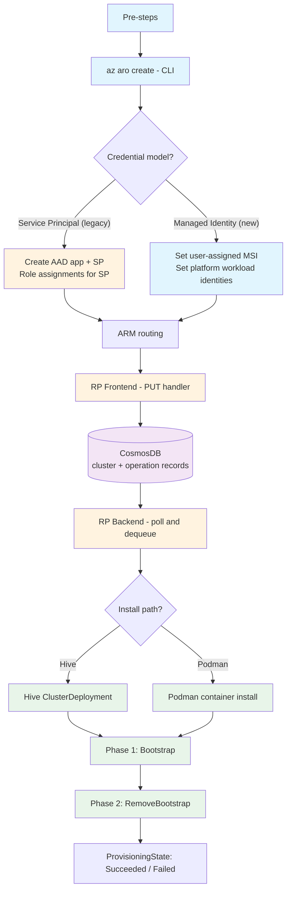
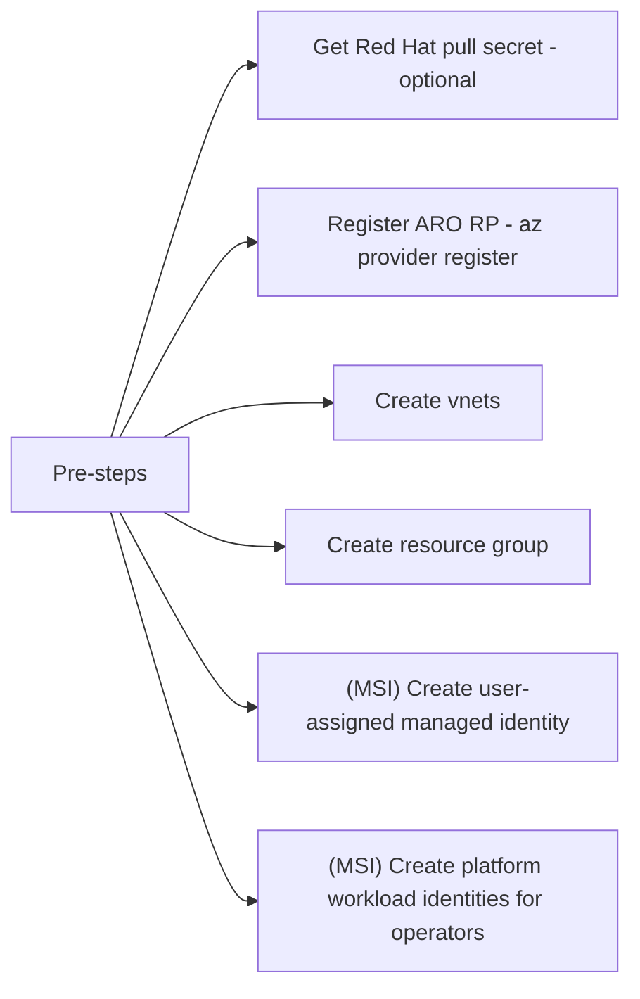
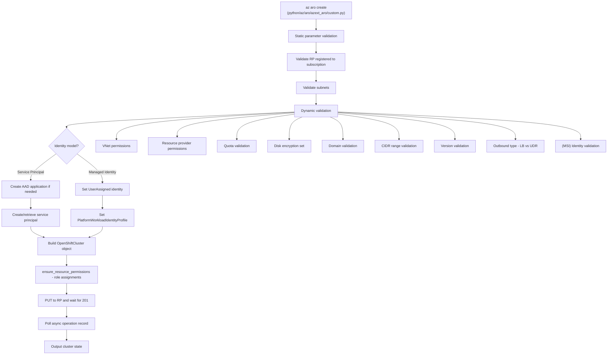
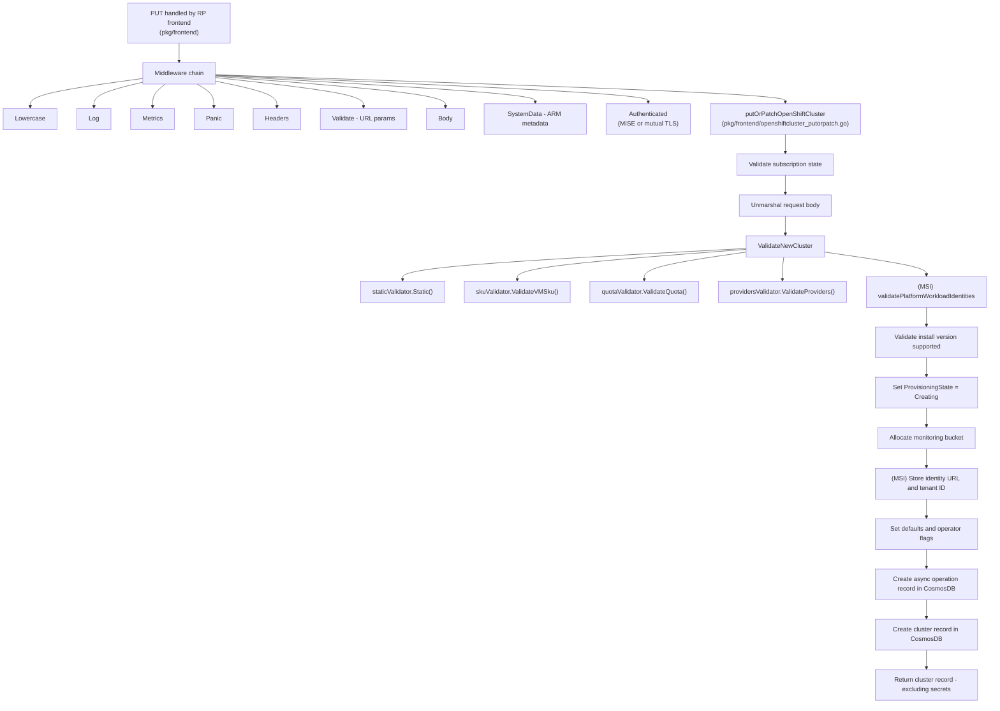
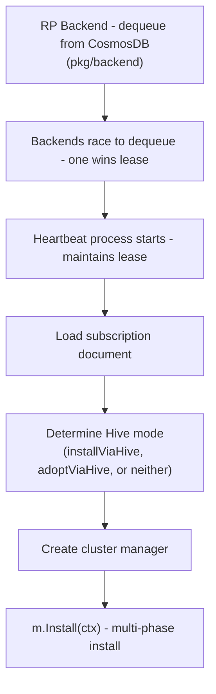
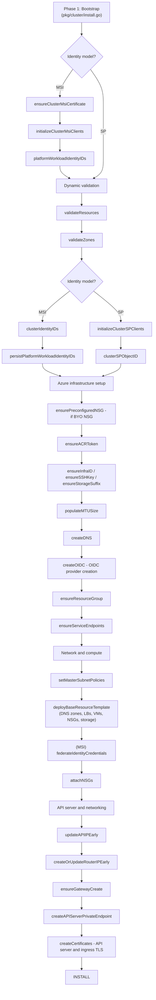
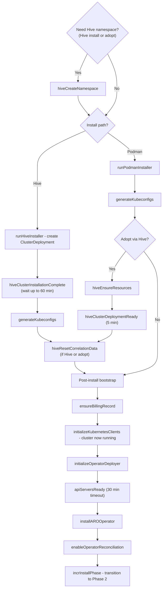
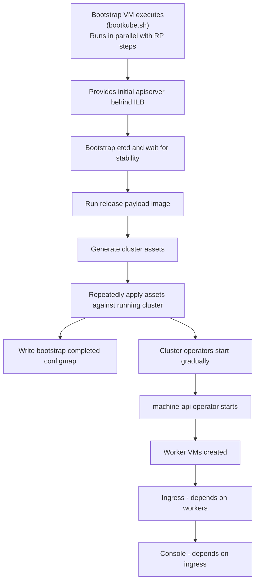

# Cluster Creation Flow

> See also: [cluster-creation.mm](cluster-creation.mm) (FreeMind/Freeplane mindmap with full detail)

## Overview

## Pre-steps

## CLI: az aro create

## RP Frontend: PUT handler

## RP Backend

## Phase 1: Bootstrap

## Bootstrap VM (parallel)

## Phase 2: RemoveBootstrap

```mermaid
flowchart TD
    P2["Phase 2: RemoveBootstrap<br/>(pkg/cluster/install.go)"] --> INIT2[Initialize clients]
    INIT2 --> RB[Bootstrap removal]

    RB --> R1["removeBootstrap<br/>(delete VM, NIC, disk)"]
    R1 --> R2["removeBootstrapIgnition<br/>(delete unencrypted, keep encrypted graph)"]
    R2 --> HEALTH

    HEALTH[API server and node health] --> H1["apiServersReady (30 min)"]
    H1 --> H2[configureAPIServerCertificate]
    H2 --> H3["apiServersReady (30 min) - recheck"]
    H3 --> H4["minimumWorkerNodesReady (30 min)"]
    H4 --> CONSOLE

    CONSOLE[Console and UI] --> C1["operatorConsoleExists (30 min)"]
    C1 --> C2[updateConsoleBranding - ARO branding]
    C2 --> C3["operatorConsoleReady (20 min)"]
    C3 --> OSCONFIG

    OSCONFIG[OpenShift configuration] --> O1[disableSamples]
    O1 --> O2[disableOperatorHubSources]
    O2 --> O3[disableUpdates - lock version]
    O3 --> O4["clusterVersionReady (30 min)"]
    O4 --> ARO

    ARO[ARO operator stabilization] --> A1["aroDeploymentReady (20 min)"]
    A1 --> A2[updateClusterData]
    A2 --> NET

    NET[Networking and storage] --> N1[configureIngressCertificate]
    N1 --> N2["ingressControllerReady (30 min)"]
    N2 --> N3[configureDefaultStorageClass]
    N3 --> N4[removeAzureFileCSIStorageClass]
    N4 --> FIN

    FIN[Finalization] --> F1[disableOperatorReconciliation]
    F1 --> F2["clusterOperatorsHaveSettled (30 min)"]
    F2 --> F3["finishInstallation<br/>(clear Install field, mark complete)"]
```

