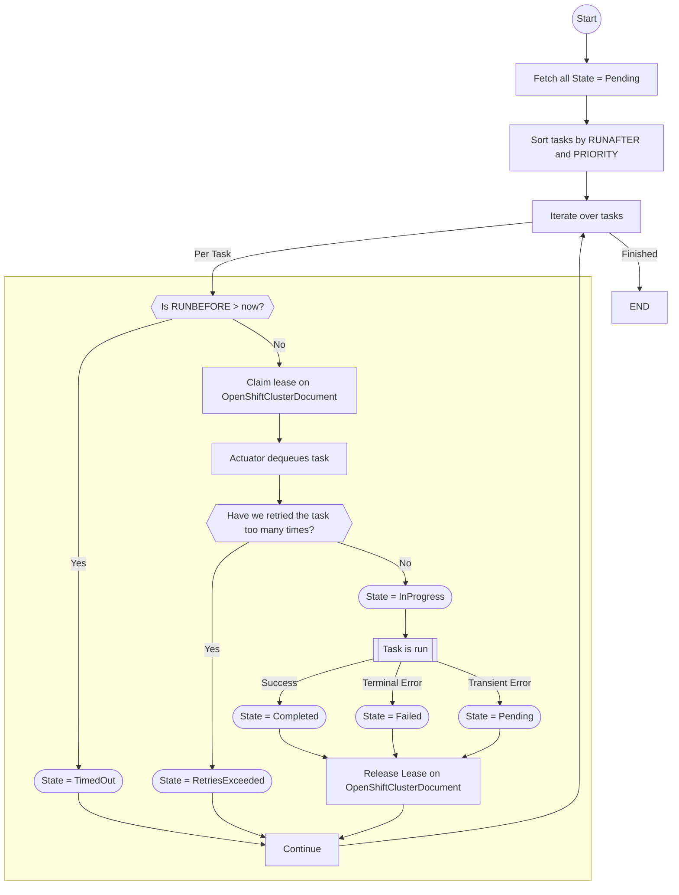

# Managed Infrastructure Maintenance Operator: Actuator

The Actuator is the MIMO component that performs execution of tasks.
The process of running tasks looks like this:

```mermaid
graph TD;
    START((Start))-->QUERY;
    QUERY[Fetch all State = Pending] -->SORT;
    SORT[Sort tasks by RUNAFTER and PRIORITY]-->ITERATE[Iterate over tasks];
    ITERATE-- Per Task -->ISEXPIRED;
    subgraph PerTask[ ]
    ISEXPIRED{{Is RUNBEFORE > now?}}-- Yes --> STATETIMEDOUT([State = TimedOut]) --> CONTINUE[Continue];
    ISEXPIRED-- No --> DEQUEUECLUSTER;
    DEQUEUECLUSTER[Claim lease on OpenShiftClusterDocument] --> DEQUEUE;
    DEQUEUE[Actuator dequeues task]--> ISRETRYLIMIT;
    ISRETRYLIMIT{{Have we retried the task too many times?}} -- Yes --> STATERETRYEXCEEDED([State = RetriesExceeded]) --> CONTINUE;
    ISRETRYLIMIT -- No -->STATEINPROGRESS;
    STATEINPROGRESS([State = InProgress]) -->RUN[[Task is run]];
    RUN -- Success --> SUCCESS
    RUN-- Terminal Error-->TERMINALERROR;
    RUN-- Transient Error-->TRANSIENTERROR;
    SUCCESS([State = Completed])-->DELEASECLUSTER
    TERMINALERROR([State = Failed])-->DELEASECLUSTER;
    TRANSIENTERROR([State = Pending])-->DELEASECLUSTER;
    DELEASECLUSTER[Release Lease on OpenShiftClusterDocument] -->CONTINUE;
    end
    CONTINUE-->ITERATE;
    ITERATE-- Finished -->END;
```
