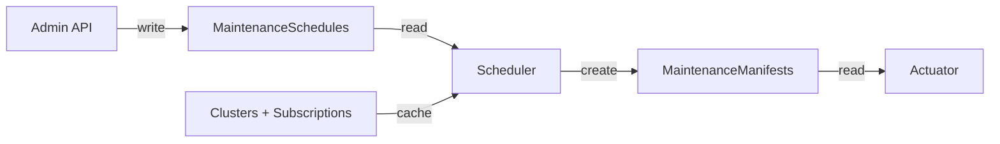

# Managed Infrastructure Maintenance Operator: Scheduler

The Scheduler is the MIMO component responsible for autonomously creating [Maintenance Manifests](./maintenance-manifest-lifecycle.md) based on configured `MaintenanceSchedule` objects. While the [Actuator](./actuator.md) executes maintenance tasks on individual clusters, the Scheduler determines when and where those tasks should run across the fleet.

## Architecture

The Scheduler runs alongside the Actuator and shares key infrastructure:

- **Bucket Partitioning**: The Scheduler uses the same bucket partitioning scheme as the Actuator (see [`pkg/util/bucket/`](../../pkg/util/bucket/)). Each Scheduler instance owns the same subset of cluster buckets as its co-located Actuator.
- **Shared Database**: Both components share the same database. The Scheduler writes `MaintenanceManifest` documents that the Actuator subsequently reads and executes.
- **Cluster Cache**: The Scheduler maintains a cache of cluster and subscription metadata, updated via database change notifications. This cache is used for selector evaluation.

The Scheduler exposes a `/healthz/ready` endpoint for readiness probes.

## Key Concepts

### MaintenanceSchedule

A `MaintenanceSchedule` defines a recurring maintenance operation applied across the fleet. Each schedule specifies:

- **Which task** to run (`maintenanceTaskID`)
- **Which clusters** it applies to (via `selectors`)
- **When to run** (via `schedule` in [calendar format](./scheduler-calendar-and-selectors.md#calendar-format))
- **How quickly** to roll out across matching clusters (`scheduleAcross`)
- **How far ahead** to pre-create manifests (`lookForwardCount`)

Schedules have two states: `Enabled` (actively creating manifests) and `Disabled` (skipped by the Scheduler).

See the [Admin API](./admin-api.md) for schedule management endpoints.

### Calendar Format

Schedules use a systemd-style calendar event format:

```
[Weekday] YYYY-MM-DD HH:MM[:SS]
```

Minutes are restricted to `0`, `15`, `30`, or `45`. The seconds component is optional and must be `00` if provided. Wildcards (`*`) and comma-separated lists are supported.

Examples:
- `Mon *-*-* 00:00` -- Every Monday at midnight
- `*-*-* 06:00` -- Every day at 06:00 UTC
- `*-*-* *:0,30` -- Every hour at the top and bottom of the hour

See [Scheduler Calendar and Selectors](./scheduler-calendar-and-selectors.md) for the full format specification.

### Selectors

Selectors determine which clusters a schedule applies to, using a syntax similar to Kubernetes label selectors. A schedule must have at least one selector. Supported operators are `eq`, `in`, and `notin`. Nine selector keys are available, covering cluster identity, subscription state, authentication type, architecture version, provisioning state, network configuration, and domain type.

See [Scheduler Calendar and Selectors](./scheduler-calendar-and-selectors.md#selectors) for the full list of keys and operators.

### Schedule Across (Thundering Herd Prevention)

The `scheduleAcross` field defines a time window over which manifest execution is spread. Each cluster's position within the window is calculated deterministically:

```
position = CRC32(lowercase(clusterResourceID)) / MaxUint32
runAfter = scheduleStartTime + (position * scheduleAcross)
```

This ensures the same cluster always runs at the same relative offset, clusters are evenly distributed, and no coordination between Scheduler instances is required.

### Look Forward Count

The `lookForwardCount` field controls how many future schedule periods the Scheduler pre-creates manifests for. For a weekly schedule with `lookForwardCount: 5`, manifests are created for the next 5 weeks. This is count-based, not duration-based.

## Data Flow



1. An operator creates a `MaintenanceSchedule` via the [Admin API](./admin-api.md)
2. The Scheduler polls for enabled schedules
3. For each schedule, the Scheduler iterates over its owned cluster buckets
4. For each cluster matching the schedule's selectors, the Scheduler calculates the next `lookForwardCount` run times
5. If no manifest already exists for a given run time, the Scheduler creates a `MaintenanceManifest` with the calculated `runAfter` timestamp
6. The Actuator picks up the manifest and executes the task at the appropriate time

The Scheduler is idempotent: if interrupted mid-cycle, the next iteration produces the same result. When a schedule is updated, the Scheduler cancels any pending manifests whose timing no longer matches the current settings.
