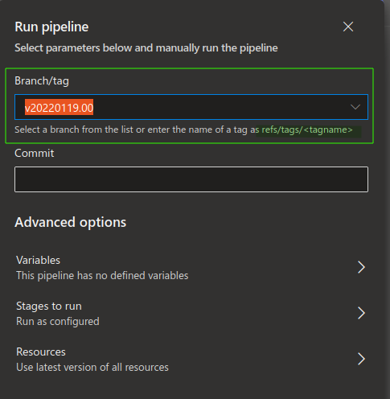

# Releases

The ARO is released with the help of annotated `git tag -a`. The tag has the
following form

```
vYYYYMMDD.nn
```

where `nn` is the release number of the day and annotation contains handpicked
release summary, which can use markdown notation. Example git command would look like:

```
git tag -a v20220223.01
```

## Prerequisite

Before the release can be created, the ARO configuration in the [ADO repository](https://msazure.visualstudio.com/AzureRedHatOpenShift/_git/RP-Config)
have to be tagged with the same tag as the ARO release. Make sure,
you are tagging the right commit with the changes you want to release.


## Release pipeline

Currently the release is done manually via the [pipeline](https://github.com/Azure/ARO-RP/blob/master/.pipelines/build-and-push-images-tagged.yml).
The pipeline does not have any parameter, instead the pipeline is started on the `tag` as illustrated on the image.




### Release page

Once the release is built, new item is added to the [GitHub release page](https://github.com/Azure/ARO-RP/releases) with
the following format:

```
# ${{TAG}}

${{tag annotation}}

## Changes:

- hash commit message
- hash commit message

## Assets:

- aro binary
- code zipped

```

The title of the release is the used `git tag`. The description is extracted
from the tag annotation.


### Image distribution

Moreover, when the release is built, the tagged ARO image is pushed to the
following registries:

- `arosvc`: production
- `arointsvc`: mirrored for integration testing