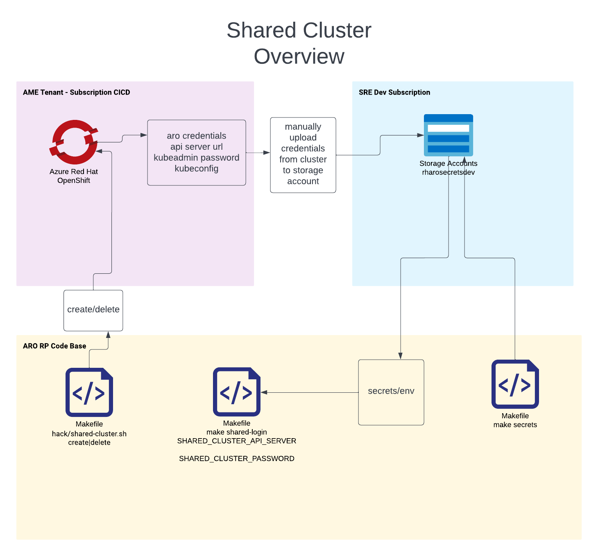

# Shared Cluster

The shared cluster now lives in the AME tenant. We have access to credentials to use the cluster, but any "operational" action must go through JIT and the Azure Portal. 

## Overview

The following diagram is the overview of where our shared cluster lives, and how we access it.

* Here is a link to the living lucid chart diagram: [here](https://lucid.app/lucidchart/1e415fe2-af56-4409-abc6-3bdf96f1bffd/edit?beaconFlowId=AB8BF83B17AD4D23&invitationId=inv_a6e62e97-2bcf-4c3a-b7b0-5dada5ea075d&page=0_0#)

## Diagram




## Authentication

You can use either to authenticate to the cluster:

* Make secrets, get and set KUBECONFIG, assuming `env` sources `secrets/env`:
```
SECRET_SA_ACCOUNT_NAME=rharosecretsdev make secrets;
. ./env;

az aro get-admin-kubeconfig \
    --name $SHARED_CLUSTER_NAME \
    --resource-group $SHARED_CLUSTER_RESOURCE_GROUP_NAME \
    --file shared-cluster.admin.kubeconfig;

export KUBECONFIG=shared-cluster.admin.kubeconfig
```

* Get details from AZ and use oc login, assuming you are logged in to the RH tenant:
```
make shared-cluster-login
```


## Creating / Deleting the Shared Cluster

The shared cluster is for general use and experimentation. All the related details for it can be found in the secrets (look for the prefix `SHARED_CLUSTER_`).
Note that there is no guarantee that it is in a "good state".


### Create / Delete
To create/ delete/ administer the cluster from az cli you must have proper permissions (JIT in the case of AME).

The following commands assume the same secrets as above.

* Create:

```bash

make shared-cluster-create

```

* Delete:

```bash
make shared-cluster-delete
```
