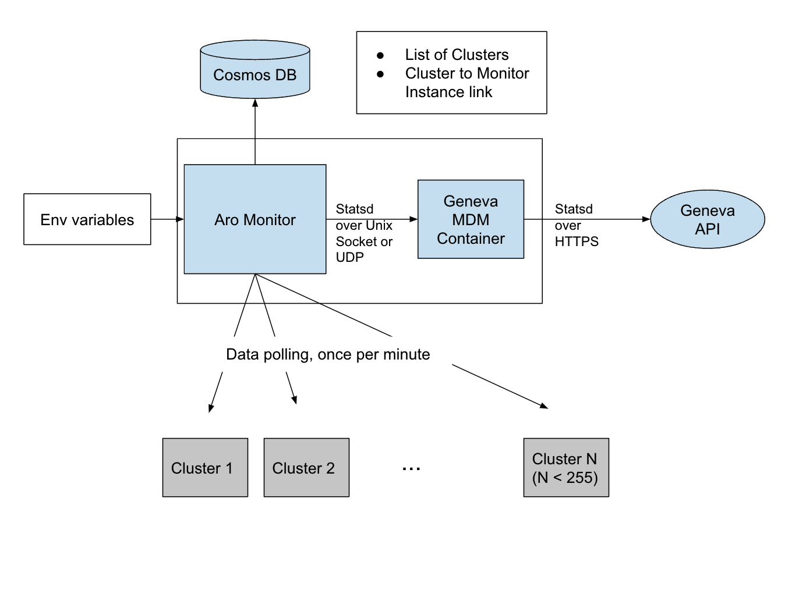
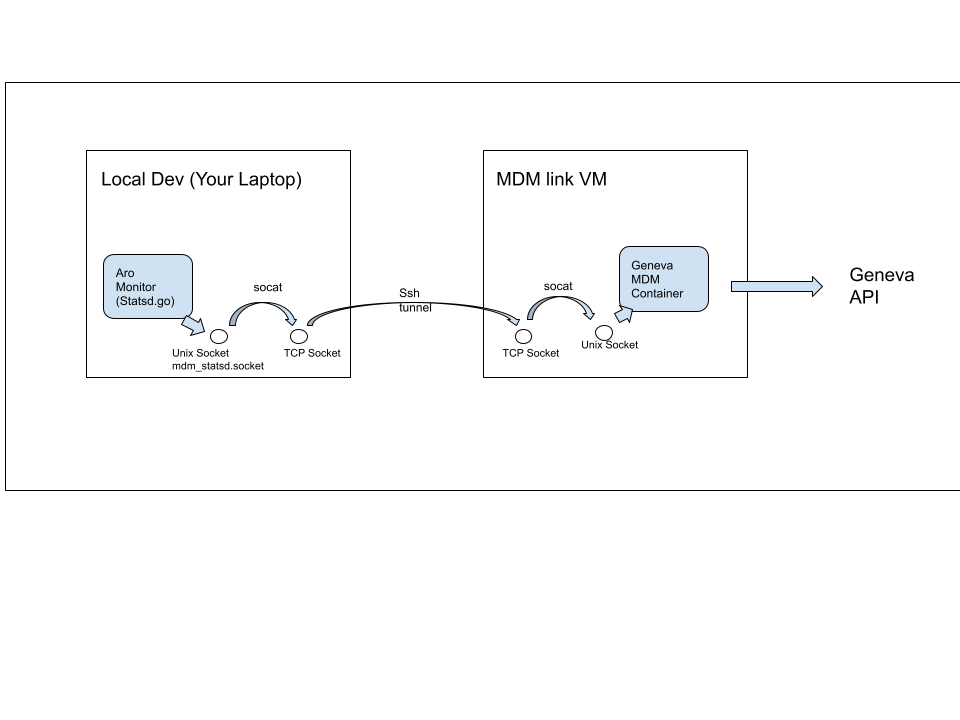

# Testing ARO Monitor Metrics


## The Monitor Architecture

The ARO monitor component (the part of the aro binary you activate when you execute ./cmd/aro monitor) collects and emits the various metrics about cluster health (and its own) we want to see in Geneva. 




To send data to Geneva the monitor uses an instance of a Geneva MDM container as a proxy of the Geneva API. The MDM container accepts statsd formatted data (the Azure Geneva version of statsd, that is) over a UNIX (Domain) socket. The MDM container then forwards the metric data over a https link to the Geneva API. Please note that using a Unix socket can only be accessed from the same machine. 

The monitor picks the required information about which clusters should actually monitor from its corresponding Cosmos DB. If multiple monitor instances run in parallel  (i.e. connect to the same database instance) as is the case in production, they negotiate which instance monitors what cluster (see : [monitoring.md](./monitoring.md)). 


## Unit Testing Setup

If you work on monitor metrics in local dev mode (RP_MODE=Development) you most likely want to see your data somewhere in Geneva INT (https://jarvis-west-int.cloudapp.net/) before you ship your code.

There are two ways to set to acchieve this: 
- Run the Geneva MDM container locally (won't work on macOS, see Remote Container section below)
- Spawn a VM, start the Geneva container there and connect/tunnel to it.

### Local Container Setup

Before you start, make sure :
- to run `source ./env`
- you ran `SECRET_SA_ACCOUNT_NAME=rharosecrets make secrets` before 
- know which "account" and "namespace" value you want to use on Geneva INT for your metric data and
  update your env to set the 
  - CLUSTER_MDM_ACCOUNT
  - CLUSTER_MDM_NAMESPACE
   

  variables before you start the monitor. 

An example docker command to start the container locally is here (you may need to adapt some parameters):
[Example](../hack/local-monitor-testing/sample/dockerStartCommand.sh). The script will configure the mdm container to connect to Geneva INT

Two things to be aware of :
* The container needs to be provided with the Geneva key and certificate. For the INT instance that is the rp-metrics-int.pem you find in the secrets folder after running `make secrets`.  The sample scripts tries to copy it to /etc/mdm.pem (to mimic production).
* When you start the montitor locally in local dev mode, the monitor looks for the Unix Socket file mdm_statsd.socket in the current directory. Adapt the path in the start command accordingly, if it's not  `./cmd/aro folder`'

### Remote Container Setup

If you can't run the container locally (because you run on macOS and your container tooling does not support Unix Sockets, which is true both for Docker for Desktop or podman) and or don't want to, you can bring up the container on a Linux VM and connect via a socat/ssh chain:


Before you start make sure:
- you can ssh into the cloud-user on your VM without ssh prompting you for anything 
- run `source ./env`
- you `az login`  into your subscription
- you ran `SECRET_SA_ACCOUNT_NAME=rharosecrets make secrets` before 
- know which "account" and "namespace" value you want to use on Geneva INT for your metric data and
  update your env to set the 
  - CLUSTER_MDM_ACCOUNT
  - CLUSTER_MDM_NAMESPACE

variables before you start the monitor. 

The [deploy script](../hack/local-monitor-testing/deploy_MDM_VM.sh) deploys such a VM called $USER-mdm-link on Azure, configures it and installs the mdm container.

The [start network script](../hack/local-monitor-testing/startMDMNetwork.sh) can then be used to established the network connection as depicted in the diagram. 

The network script will effectively start run three commands (with more error handling):
````

PUBLICIP=<IP of your VM>

BASE=$( git rev-parse --show-toplevel)
SOCKETFILE=$BASE/cmd/aro/mdm_statsd.socket

ssh cloud-user@$PUBLICIP 'sudo socat -v TCP-LISTEN:12345,fork UNIX-CONNECT:/var/etw/mdm_statsd.socket'

ssh $CLOUDUSER@$$PUBLICIP -N -L 12345:127.0.0.1:12345

socat -v UNIX-LISTEN:$SOCKETFILE,fork TCP-CONNECT:127.0.0.1:12345
````

For debugging it might be useful to run these commands manually in three different terminals to see where the connection might break down. The docker log file should show if data flows through or not, too.


### Stopping the Network script

Stop the script with Ctrl-C. The script then will do its best to stop the ssh and socal processes it spawned.


### Starting the monitor

When starting the monitor , make sure to have your

- CLUSTER_MDM_ACCOUNT
- CLUSTER_MDM_NAMESPACE
  
environment variables set to Geneva account and namespace where you metrics is supposed to land in Geneva INT (https://jarvis-west-int.cloudapp.net/)

Use `go run -tags aro ./cmd/aro monitor`  to start the monitor. You want to check what the current directory of your monitor is, because that's the folder the monitor will use to search for the mdm_statds.socket file and that needs to match where your mdm container or the socat command creates it. Please note that in local dev mode the monitor will silently ignore if it can't connect to the socket.

A VS Code launch config that does the same would look like.

````
{
            "name": "Launch Monitor",
            "type": "go",
            "request": "launch",
            "mode": "auto",
            "program": "./cmd/aro",
            "buildFlags": "-tags aro",
            "console": "integratedTerminal",
            "args": ["-loglevel=debug",
                "monitor",
            ],    
            "env": {"CLUSTER_MDM_ACCOUNT": "<PUT YOUR ACCOUNT HERE>",
            "CLUSTER_MDM_NAMESPACE":"<PUT YOUR NAMESPACE HERE>" }    
        },
````


### Finding your data

If all goes well, you should see your metric data  in the Jarvis metrics list (Geneva INT (https://jarvis-west-int.cloudapp.net/) -> Manage ->  Metrics) under the account and namespace you specified in CLUSTER_MDM_ACCOUNT and CLUSTER_MDM_NAMESPACE and also be available is the dashboard settings.


### Injecting Test Data into Geneva INT

Once your monitor code is done you will want to create pre-aggregates, dashboards and alert on the Geneva side and test with a variety of data.
Your end-2-end testing with real cluster will generate some data and cover many test scenarios, but if that's not feasible or too time-consuming you can inject data directly into the Genava mdm container via the socat/ssh network chain.

An example metric script is shown below, you can connect it to 


````
myscript.sh | socat TCP-CONNECT:127.0.0.1:12345 - 
````
or 
````
myscript.sh | socat UNIX-CONNECT:$SOCKETFILE - 
````
(see above of the $SOCKETFILE )


#### Sample metric script

````
#!/bin/bash
# example metric 
CLUSTER="< your testcluster example name>"
SUBSCRIPTION="<  your subscription here >"
METRIC="< your metric name>"
ACCOUNT="< your CLUSTER_MDM_ACCOUNT >"
NAMESPACE="< CLUSTER_MDM_NAMESPACE>"
DIM_HOSTNAME="<your hostname >"
DIM_LOCATION="< your region >"
DIM_NAME="pod-$CLUSTER"
DIM_NAMESPACE="< somenamespace> "
DIM_RESOURCEGROUP="< your resourcegroup> "
DIM_RESOURCEID="/subscriptions/$SUBSCRIPTION/resourceGroups/$DIM_RESOURCEGROUP/providers/Microsoft.RedHatOpenShift/openShiftClusters/$CLUSTER"
DIM_RESOURCENAME=$CLUSTER

### or read data from file, like: data=$( cat mydatafile )
data="10 11 12 13 13 13 13 15 16 19 20 21 25"
SLEEPTIME=60
for MET in $data ;do
OUT=$( cat << EOF 
{"Metric":"$METRIC",
"Account":"$ACCOUNT",
"Namespace":"$NAMESPACE",
"Dims":
    {"hostname":"$DIM_HOSTNAME",
    "location":"$DIM_LOCATION",
    "name":"$DIM_NAME",
    "namespace":"$DIM_NAMESPACE",
    "resourceGroup":"$DIM_RESOURCEGROUP",
    "resourceId":"$DIM_RESOURCEID",
    "resourceName":"$DIM_RESOURCENAME",
    "subscriptionId":"$SUBSCRIPTION"
},
"TS":"$DATESTRING"}:${MET}|g
EOF
)

echo $OUT
sleep $SLEEPTIME
done

````

